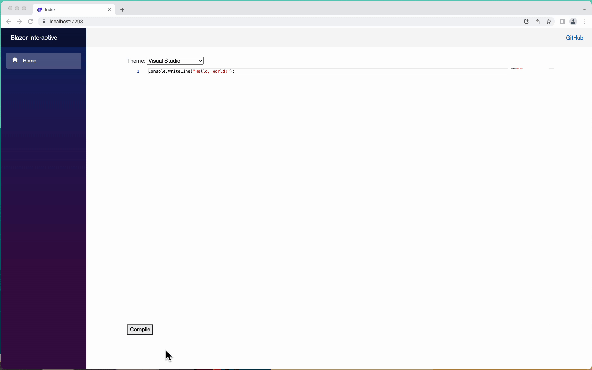
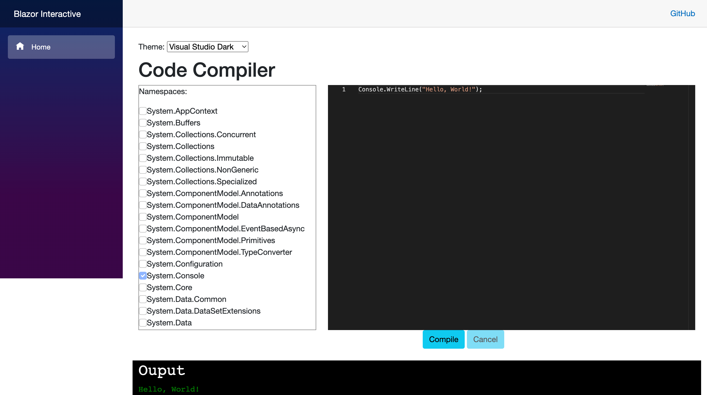

# Blazor Interactive

> Blazor C# Interactive (Try .NET)

<!--  -->
<!--  -->
 <!-- https://opensource.org/licenses/MIT -->

<!--  -->

## Demo

## Solution

| Project                                      | Type              | Info |
| -------------------------------------------- | ----------------- | ---- |
| BlazorInteractive                            | BlazorWebAssembly |      |
| BlazorInteractive.Compilation                |                   |      |
| BlazorInteractive.Compilation.Tests          |                   |      |
| BlazorInteractive.DependencyManagement       |                   |      |
| BlazorInteractive.DependencyManagement.Tests |                   |      |
| BlazorInteractive.Tests                      |                   |      |

## Tests

- [BlazorInteractive Tests](https://gist.github.com/alex-hedley/0f6142396b2a1bb0231906adcd51bdcd)
- [BlazorInteractive Compilation Tests](https://gist.github.com/alex-hedley/1a73c5dd2824cc80bfd2c145308dbcf9)
<!-- - [BlazorInteractive Dependency Management Tests](https://gist.github.com/alex-hedley/###) -->

Output using [dotnet-tests-report](https://github.com/marketplace/actions/dotnet-tests-report) ([Code](https://github.com/zyborg/dotnet-tests-report))

## Docs

- [Info](docs/README.md)
- Blog Post - [.NET Blazor Interactive](https://alexhedley.com/blog/posts/dotnet-blazor-interactive)
- 🎙️ Talk - [Presentation](https://alex-hedley.github.io/talk-blazorinteractive/)
